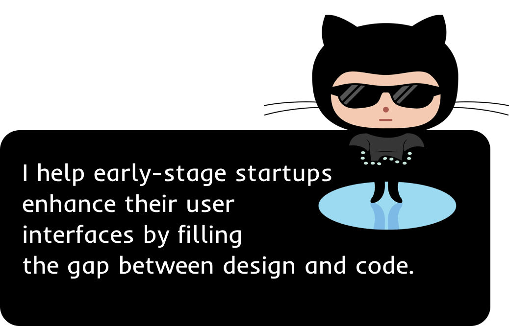
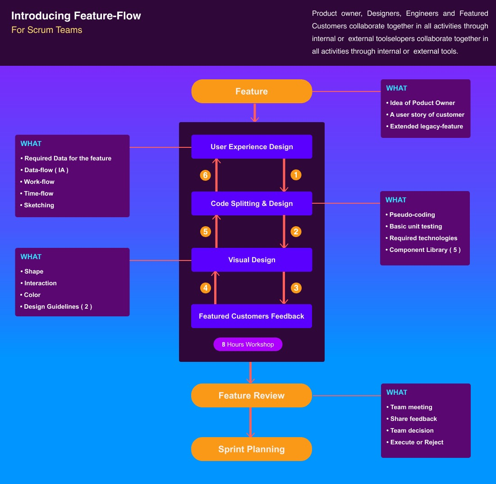

 

 
 

 
 
 
 

Hi! My name is Ala Eddine, I'm a software engineer from Algeria. I falt in love with programming by watching the New Boston videos, he is so popular tutor in the USA. In 2016, I graduated from the University 2 of Constantine with a first-wining project which is a Windows application for streamlining the management process at a campus of students. After 6 months, I drop out of college and built my first desktop commercial application from scratch for a building company with millions in capital using Java, JavaFX, CSS3, and Hibernate. I learned a lot from this experience about programming, solopreneurship, marketing, negotiation, and more. Because the university did not fill my passion for programming, so I started learning about UI design, Web Development, Startups, Entrepreneurship, and more topics by watching videos and reading books, I ended up reading more than 100 books about programming and business. My latest book is Refactoring UI by Adams Wathan the creator of TailwindCSS.

Lately, I committed to creating a successful open-source project though I failed several times however I created some projects I'm proud of :

#### 1. You Don't Kow UI:
A collection of detailed pro tips about designing and developing modern user interfaces for the web.

#### 2. Leetcode JS:
Inspired by Lodash. A library that simplifies complex array problems with an easy-to-use API. This eliminates the need for additional code, empowering developers to streamline their programming process.

#### 3. One Night Maker
A collection of mini projects created in a single night.

 
 

 

  

 
<image src="https://github.com/MenaiAla/MenaiAla/blob/master/linkedin-tip-02.jpeg"/>
 
 

 
  
 
 

  
 

 
  
 

 

 
 

 
  
 

  
 

 
 

 
 

 

 

 <i>Use my feature-flow diagram to accelerate your development workflow</i>
 

 
 
 
 
 

 
 
 &nbsp;&nbsp;&nbsp;&nbsp;
 

 

 

 

 

 

 
  
 
 

</body>

